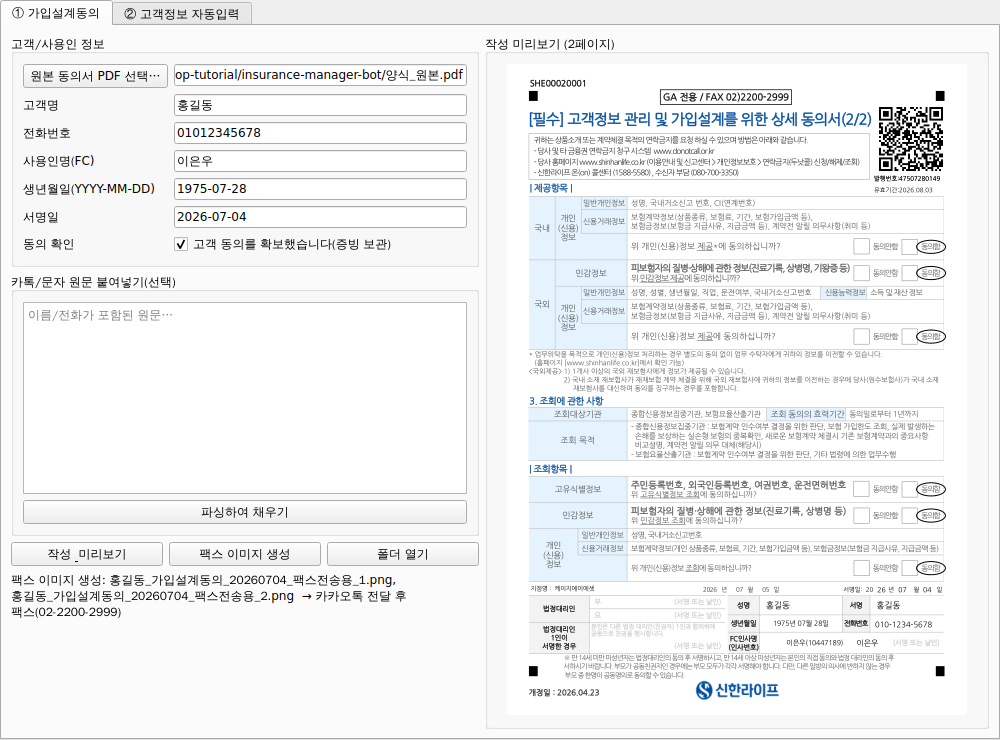

# 보험 매니저 봇 (구현)

신한라이프 GA 업무 반자동화 데스크톱 RPA. **두 프로젝트를 별개로** 구현한다.

| | 프로젝트 ① 가입설계동의 봇 | 프로젝트 ② 고객정보 자동입력 봇 |
|--|--|--|
| 목표 | 동의서 PDF 작성 + 팩스용 이미지 생성·전달 | GA 화면에 고객정보(이름·전화·주소·주민번호) 입력 |
| 진입점 | `python -m consent_bot.app` | `python -m entry_bot.app` |
| 기획안 | [`기획안.md`](기획안.md) | [`기획안_2_고객정보_자동입력.md`](기획안_2_고객정보_자동입력.md) |

## 구조
```
insurance-manager-bot/
├── 기획안.md, 기획안_2_고객정보_자동입력.md   # 기획 문서
├── 양식_원본.pdf                              # 실제 동의서 양식(2장)
├── common/          # 공통 모듈(양 프로젝트 공유)
│   ├── validation.py   # 주민번호 체크섬·전화·생년월일 검증/마스킹
│   ├── parsing.py      # 카톡/문자 자유텍스트 → 항목 추출(+신뢰도)
│   ├── secure.py       # keyring 자격증명 + 마스킹
│   └── state.py        # SQLite 이력·중복방지·동의 증빙 audit trail
├── consent_bot/     # 프로젝트 ①
│   ├── template.json   # 이 양식의 좌표 템플릿(동의함 11곳 + 서명 블록)
│   ├── fill_pdf.py     # 좌표 기반 PDF 기재(동의함 동그라미 + 서명/날짜/전화)
│   ├── to_fax_images.py# PDF → 팩스용 PNG(그레이스케일 고DPI)
│   ├── ga_automation.py# GA 웹 자동화(로그인 수동 게이트) — ★셀렉터 캘리브레이션 필요
│   └── app.py          # 오케스트레이터(상태머신)
├── entry_bot/       # 프로젝트 ②
│   ├── ga_login.py     # 반자동 로그인(ID/PW 자동 + 간편PW 수동)
│   ├── ga_form_fill.py # 필드 자동 입력 — ★셀렉터 캘리브레이션 필요
│   └── app.py          # 오케스트레이터(제출 전 사람 확인 게이트)
├── ui/app_ui.py     # 데스크톱 UI(PySide6): 두 봇 탭 + ① 작성 미리보기
├── tools/calibrate_template.py  # 양식 개정 시 좌표 재추출
└── tests/test_validation.py
```

## 데스크톱 UI 실행
```bash
python -m ui.app_ui
```


- 탭 ① 가입설계동의: 입력/카톡 파싱 → [작성 & 미리보기](우측에 작성된 동의서 실시간 표시)
  → [팩스 이미지 생성] → [폴더 열기]. 동의 확인 체크가 있어야 작성됨.
- 탭 ② 고객정보 자동입력: 카톡 [파싱 & 검증] → 주민번호 **체크섬 검증 + 마스킹 표시**.
- **이미지 OCR 입력**: 두 탭 모두 사진을 창에 **드래그드롭**하거나 [이미지 불러오기(OCR)]로
  종이/신분증/카톡 스크린샷에서 항목을 자동 추출(온디바이스 Tesseract, 클라우드 전송 없음).
- 리눅스에서 Qt 실행 시 시스템 라이브러리 필요: `apt-get install libegl1 libgl1 libxkbcommon0`.
  OCR: `apt-get install tesseract-ocr tesseract-ocr-kor`.

## Windows 배포(exe)
파이썬 없이 더블클릭 실행하도록 단일 exe로 패키징한다 → [`packaging/build_windows.md`](packaging/build_windows.md).
한글 폰트(`assets/NanumGothic.ttf`)와 좌표 템플릿은 exe에 번들된다.

## 설치
```bash
pip install -r requirements.txt
playwright install chromium         # 웹 자동화 사용 시
# 한글 PDF 기재 폰트: NanumGothic (fonts-nanum). fill_pdf.py의 _FONT 경로 확인.
```

## 프로젝트 ① 실행 (입력→작성→팩스이미지, 검증 완료)
```bash
# GA 웹 단계를 건너뛰고, 이미 저장한 원본 동의서 PDF로 바로 작성
python -m consent_bot.app --src 양식_원본.pdf --skip-ga \
    --name 홍길동 --phone 01012345678 --agent 이은우 \
    --birth 1975-07-28 --date 2026-07-04 --assume-consent --yes --out ./output
```
→ `output/홍길동_가입설계동의_YYYYMMDD.pdf` + 팩스용 PNG 2장 생성. 동의함 11곳 동그라미,
서명일·성명·서명·전화번호·FC 서명이 실제 양식 좌표에 기재됨(렌더링 검증 완료).

전체 흐름(GA 포함)은 로그인·간편PW를 사용자가 수행한 뒤 이후 단계가 자동화된다.

## 프로젝트 ② 실행 (파싱·검증까지 검증 완료)
```bash
# 카톡 원문 파싱 → 주민번호 체크섬 검증 → 마스킹 확인 (웹 입력 안 함)
python -m entry_bot.app --paste-file tests/sample_kakao.txt --dry-run --yes
# 실제 입력: keyring에 자격증명 등록 후
python -c "from common.secure import save_credentials as s; s('default','아이디','비번')"
python -m entry_bot.app --paste-file kakao.txt --user-key default
```

## 테스트
```bash
python tests/test_validation.py     # 또는 pytest
```

## 상태
- ✅ **검증 완료(이 환경에서 실행 확인)**: PDF 좌표 기재, 팩스 이미지 생성, 카톡 파싱,
  주민번호 체크섬·마스킹, 중복 방지, 상태 기록.
- ⚠️ **실제 GA 사이트 캘리브레이션 필요**: `ga_automation.py`/`ga_login.py`/`ga_form_fill.py`의
  `SELECTORS`는 구조 예시(placeholder). 운영 화면에서 개발자도구로 확정해야 한다.
  (로그인·간편비밀번호는 설계상 항상 사용자 수동.)

## 보안·컴플라이언스 원칙(요약)
- 주민번호: 온디바이스 처리, 메모리 전용·즉시 폐기, **로그/DB 저장 금지**, 화면 마스킹, 체크섬 검증.
- 자격증명: keyring(OS 보안 저장소). 간편비밀번호는 저장하지 않음.
- 서명·동의(①): 사전 동의 확보 전제 + **동의 증빙 audit trail 보관**. 상세는 `기획안.md` §4.3.
- 제출/전송 직전 **사람 확인 게이트** 필수(②는 자동 제출 금지).
