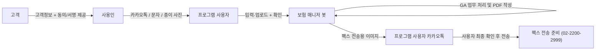

# 보험 매니저 봇 제작 기획안 (v2 · 시니어 검토 반영본)

> 대상 업무: 신한라이프 GA `가입설계동의` 서류 생성 → 팩스 전송용 이미지 제작 → 프로그램 사용자 카카오톡 전달
> 성격: **반자동(휴먼인더루프) 데스크톱 RPA 도구**. 완전 무인 자동화가 아님.
> 작성 기준: 첨부 원본 업무 흐름 + `insurancemanagerbotplanning.md`를 검토·보강.
> 최종 수정: 2026-07-04

---

## 0. v2에서 바뀐 것 (검토 요약)

원본 기획안은 실무 감각이 좋습니다. 아래 5가지를 보강했습니다.

| # | 항목 | 원본 | v2 보강 |
|---|------|------|---------|
| 1 | **서명·동의 자동기재** | PDF에 `서명(고객명)` 자동 입력 | **원안대로 봇이 동의 체크·서명 직접 기재.** 운영 전제 = **사전 동의 확보** + **동의 증빙 보관(audit trail)**. 용도 = 동의 후 고객에게 보여줄 서류 (§4.3, §12-1) |
| 2 | GA 사이트 자동화 | Playwright 자동화 | 약관·안정성 리스크 명시, 셀렉터 우선·UI 변경 감지·수동 이관 (§6.2, §11) |
| 3 | OCR | Tesseract/Vision/OpenAI 병기 | 개인정보 국외이전 이슈 → **온디바이스 OCR 우선** (§6.1, §9) |
| 4 | 중복 실행 | 언급 없음 | **멱등성/처리완료 상태 관리** 추가 (§6.5, §7) |
| 5 | 단계 완료 판정 | 단계 나열 | 각 단계 **성공 판정 기준(Acceptance)** 추가 (§5, §10) |

---

## 1. 목적

가입설계동의 업무에서 반복되는 **고객정보 정리 → GA 웹 입력 → PDF 저장 → PDF 작성 → 팩스용 이미지 전달** 과정을 반자동화하여 처리 시간과 입력 오류를 줄인다.

**1차 목표는 완전 무인화가 아니라**, 보안·정확성·법적 책임이 걸린 단계(로그인, 간편비밀번호, 동명이인 선택, 고객 서명·동의, 최종 전송)에 **사람 확인을 남긴 반자동 도구**를 만드는 것이다.

### 성공 지표(KPI)
- 건당 처리시간: 수기 대비 **50% 이상 단축**
- 필수정보(고객명/생년월일/전화번호) **입력 오류 0건**(사용자 확인 통과 기준)
- 파일명·저장위치 표준 준수율 100%
- 예외 발생 시 **처음부터 재시작 없이** 현재 단계에서 복구 가능

---

## 2. 대상 업무와 관계자

사용인이 고객에게서 받은 고객정보를 프로그램 사용자가 봇에 전달하면, 봇이 신한라이프 GA에서 신규가입설계동의 서류를 생성하고, 최종 산출물을 **팩스 전송용 이미지**로 만들어 프로그램 사용자 카카오톡으로 전달한다.

| 관계자 | 역할 |
|--------|------|
| 고객 | 업무 대상자. 고객정보와 **동의·서명**을 제공 |
| 사용인 | 고객과 직접 소통, 고객정보 수집 |
| 프로그램 사용자 | 봇 실행, 입력값 확인, 로그인·간편비밀번호 입력, 최종 전달 확인 |
| 보험 매니저 봇 | 정보 정리, GA 자동화, PDF 작성, 팩스용 이미지 생성·전달 준비 |



### 기준 업무 흐름 (원본 신한라이프 GA 절차 반영)
1. 고객 → 사용인에게 고객정보(+동의/서명) 제공
2. 사용인 → 프로그램 사용자에게 카카오톡/문자/종이사진으로 전달
3. 프로그램 사용자 → 봇에 입력 또는 업로드
4. 봇: 고객명·생년월일·전화번호 정리
5. 프로그램 사용자: 입력값 확인·수정
6. GA 접속 `https://ga.shinhanlife.co.kr`
7. **사용자**가 로그인 + 간편비밀번호 입력 (봇 제외)
8. 고객관리 → 위탁가입설계동의(고객등록)
9. 코드 검색·선택 (동명이인 시 **사용자 확인**, 예: 이름 옆 코드명으로 구분)
10. 신규가입설계동의 생성 → 서면동의(선택)
11. 생년월일 입력 → 확인 → 확인 → 인쇄 → 저장(저장명=가입자명)
12. PDF(2장) 저장
13. PDF 내: `동의함` 체크 · 서명일(오늘) · **고객 서명** · 전화번호 · 사용인명(서명) 기재 → 저장
14. 팩스 전송용 이미지 생성
15. 프로그램 사용자 카카오톡으로 이미지 전달 → 사용자가 팩스 전송

---

## 3. 1차 제작 범위 (In / Out)

### 포함 (In-scope)
- 고객명·생년월일·전화번호·사용인명 입력 화면
- 입력 경로 3종: **직접 입력 / 텍스트 붙여넣기 파싱 / 이미지 업로드 OCR**
- 입력값 검토·수정 화면 (사용자 확정 게이트)
- GA 사이트 자동 열기
- **로그인·간편비밀번호는 사용자 수동**, 이후 사용자가 "진행" 누르면 자동화 재개
- 고객관리 → 동의서 생성 단계 자동화 (셀렉터 기반)
- PDF 저장 파일명 자동 지정
- 고정 양식 PDF에 체크·날짜·전화번호·사용인명·**고객 서명** 자동 기재 (원안대로 봇이 직접 처리)
- **동의 증빙 보관**: 사용인이 받은 카톡/문자/사진 등 동의 근거를 건별 audit trail로 저장
- 완성 PDF 미리보기 / 저장 폴더 열기
- 팩스 전송용 이미지 생성 (PNG, 고해상도 흑백 권장)
- 프로그램 사용자 카카오톡으로 이미지 전송(또는 폴더 열기 수동 대체)
- 처리 결과 로그 저장 (마스킹)

### 제외 (Out-of-scope, v1)
- 간편비밀번호 키패드 자동 클릭 (매번 위치 변경)
- 동명이인 완전 자동 확정
- 웹팩스/모바일팩스 완전 자동 전송
- 고객·사용인에게 직접 카카오톡 발송

---

## 4. 설계 원칙

### 4.1 보안 우선
- 로그인 ID/PW/간편비밀번호는 **코드·평문 설정파일에 저장 금지**. OS 보안 저장소(Windows Credential Manager / macOS Keychain) 또는 암호화 설정 사용.
- 간편비밀번호는 셔플 키패드이므로 **자동 클릭 제외**, 사용자 직접 입력.

### 4.2 사람 확인 게이트 (반드시 사용자 승인)
- OCR/붙여넣기로 추출한 고객정보
- GA 로그인·간편비밀번호
- 동명이인 코드 선택
- 완성 PDF 미리보기
- 카카오톡 전달 이미지 및 대상 채팅방

### 4.3 서명·동의 자동 기재 (운영 전제: 사전 동의 확보)
- **용도**: 사용인이 고객에게 **사전 동의를 받은 뒤**, 그 내용을 담은 가입설계동의 서류를 봇이 작성하여 **고객에게 보여주기 위한** 것이다.
- 원안대로 봇이 `동의함` 체크·서명일·**서명**·전화번호·사용인명을 직접 기재한다.
- **동의 증빙 보관(필수 안전장치)**: 각 건마다 동의 근거(카톡/문자 원문·통화메모·사진 등)를 audit trail로 저장하여, "동의 후 작성" 사실을 남긴다. 분쟁 시 사용자를 보호한다.
- 동의 근거가 없는 건은 **Hold**로 두고, 사용자가 동의 확인을 체크해야 진행한다.
- **책임 소재**: 고객 동의 확보의 책임은 사용인/프로그램 사용자에게 있으며, 봇은 확보된 동의를 전제로 서류를 작성한다. (해당 서류·모집행위의 적법성은 사용자 측 준법 기준에 따른다.)

### 4.4 고정 양식 = 좌표 기반 작성
- PDF 양식이 고정이므로 체크박스·날짜·전화번호·사용인명·서명 위치를 **템플릿 좌표(JSON)** 로 정의하고 입력값을 삽입. 양식 버전 관리(양식 변경 감지).

### 4.5 단계별 재시도 가능 (체크포인트)
- 각 단계 완료 시 **체크포인트 저장** → 오류 시 처음부터가 아니라 현재 단계에서 재시도/수동 보정 후 계속.

### 4.6 입력 경로 다양성
- 직접 입력 / 붙여넣기 파싱 / 이미지 OCR 3종. 어떤 경로든 **사용자 확인 게이트**를 통과해야 다음 진행.

---

## 5. 처리 단계별 상태와 완료 판정 (State Machine)

봇은 아래 상태를 순차 진행하며, 각 상태의 **완료 판정 기준**을 만족해야 다음으로 넘어간다. 실패 시 해당 상태에서 재시도.

| 상태 | 행위 | 완료 판정 기준 |
|------|------|----------------|
| `INPUT` | 고객정보 입력/업로드 | 필수 3항목 존재 |
| `EXTRACT` | 붙여넣기/OCR 파싱 | 항목별 신뢰도 표시, 사용자 확정 |
| `CONFIRM` | 사용자 검토·수정 | 사용자 "확정" 클릭 |
| `CONSENT` | 동의 증빙 확인·보관 | 동의 근거 존재·저장 (없으면 사용자 확인 or Hold) |
| `GA_OPEN` | GA 열기 | 로그인 페이지 로드 |
| `GA_LOGIN` | 사용자 로그인·간편PW | 사용자 "진행" 클릭, 세션 유효 |
| `GA_NAV` | 고객관리→동의 화면 | 목표 화면 요소 확인 |
| `GA_PICK` | 코드 검색·선택 | 단일 후보 or 사용자 선택 완료 |
| `GA_CREATE` | 동의서 생성·생년월일 입력 | 생성 완료 화면 확인 |
| `PDF_SAVE` | 인쇄·저장(2장) | 파일 2개 존재·페이지수 검증 |
| `PDF_FILL` | 체크·날짜·전화·사용인명·서명 삽입 | 좌표 검증 통과 |
| `IMG_MAKE` | 팩스용 이미지 변환 | PNG 생성·해상도 확인 |
| `DELIVER` | 카카오톡 전달/폴더 열기 | 전송 or 사용자 수동 확인 |
| `DONE` | 완료 기록 | 로그 저장, 중복방지 마킹 |

---

## 6. 시스템 구성

### 6.1 사용자 화면 (업무 패널)
- 입력: 고객명 · 생년월일 · 전화번호 · 사용인명
- 고객정보 원문 붙여넣기 / 이미지 업로드
- **추출 결과 확인·수정** (항목별 신뢰도 뱃지)
- **동의 증빙 상태 표시**(확보/미확보) 및 증빙 첨부
- 진행 상태(상태머신) 표시 / 다음 단계 버튼
- PDF 미리보기 / 완성 폴더 열기

> OCR은 **온디바이스(Tesseract 또는 PaddleOCR) 우선**. 정확도 부족 시 클라우드 Vision은 **개인정보 처리 동의·마스킹 전제 하 옵션**으로만. (§9)

### 6.2 웹 자동화 모듈
- 사이트 열기 → 로그인 완료 대기 → 고객관리 이동 → 고객 검색 → 동의서 생성 화면 → 생년월일 입력 → 인쇄·저장 흐름.
- **HTML 셀렉터 우선**, 좌표 클릭은 최후. UI 변경 감지 시 자동화 중단하고 사용자 이관.
- 로그인·간편비밀번호는 사용자 몫(봇 제외).
- 리스크: 파트너 포털 자동화는 약관 제약 가능 → 준법 확인(§11, §12).

### 6.3 PDF 작성 모듈
- 저장된 PDF 로드 → 고정 좌표에 삽입:
  - `동의함` 체크 · 서명일(오늘) · **고객 서명** · 전화번호 · 사용인명 → 저장
  - 서명 표현 방식(텍스트/서명 이미지)은 §12-4 결정에 따름
  - 팩스용 이미지 변환
- 파일명 규칙:
```text
고객명_가입설계동의_YYYYMMDD.pdf
고객명_가입설계동의_YYYYMMDD_팩스전송용_1.png
고객명_가입설계동의_YYYYMMDD_팩스전송용_2.png
```

### 6.4 파일 전달 모듈
- 완성 PDF + 팩스용 이미지 생성 → **프로그램 사용자 카카오톡**으로 전달이 기본 목표.
- 완료 기준: 팩스 전송용 이미지를 프로그램 사용자 카카오톡으로 전달.
- 카카오톡 PC 자동화 또는 OS 공유기능 우선. 불안정 시 **완성 폴더 자동 열기 + 사용자 수동 전송** 대체 흐름 제공.

### 6.5 상태·중복방지 저장소 (신규)
- 로컬 SQLite에 처리 이력·체크포인트·**고객별 처리완료 키**(예: `고객명+생년월일+업무일`) 저장 → 재실행 시 중복 생성 방지, 재개 가능.
- **동의 증빙 보관소**: 건별 동의 근거 파일(카톡/문자/사진)을 암호화 저장하고 처리 건과 연결(audit trail).

---

## 7. 예외 처리

감지 또는 사용자 확인 요청 대상:
- 로그인 세션 만료 / 사이트 화면 변경
- 고객 검색 결과 없음 / 동명이인 다수
- 이미지 OCR 실패 / 원문에서 필수항목 추출 실패
- PDF 저장 실패 / 페이지 수 불일치 / 작성 위치 검증 실패
- 팩스용 이미지 변환 실패
- 카카오톡 PC 실행 실패 / 채팅방 탐색 실패 / 첨부·전송 실패
- 완성 파일 열기 실패
- **(신규)** 동의 증빙 미확보 → 사용자 확인 요청 or Hold
- **(신규)** 동일 건 중복 감지 → 사용자 확인 후에만 재생성

원칙: 예외 시 **현재 상태에서 재시도/수동 보정** 후 계속. 처음부터 재시작 금지.

---

## 8. 로그 정책

**저장:** 처리일시 · 고객명 · 생년월일(일부 마스킹) · 생성 파일명 · 입력경로 구분 · 성공/실패 · 실패 단계 · 처리완료 키
**저장 금지:** 로그인 PW · 간편비밀번호 · 주민등록번호 전체 · 연락처 전체 · PDF 원문 전문 · 카톡/문자 원문 전문 · 서명 이미지 원본(별도 보관 시 암호화·보존기간 명시)

---

## 9. 기술 스택

### 권장 (v1)
- **언어**: Python (빠른 제작·유지보수)
- **웹 자동화**: Playwright (셀렉터 기반)
- **PDF**: PyMuPDF(fitz) 또는 pypdf + reportlab (좌표 삽입)
- **OCR**: **Tesseract / PaddleOCR (온디바이스 우선)** — 개인정보 국외이전 회피
- **UI**: PySide6(데스크톱) 또는 웹 기반 로컬 UI(FastAPI + 브라우저)
- **저장소**: SQLite (이력·체크포인트·중복방지)
- **자격증명**: keyring (OS 보안 저장소 연동)
- **카카오톡 전달**: 카카오톡 PC 자동화 또는 OS 공유, 실패 시 폴더 열기 대체

### 대안
- Node.js + Playwright / Electron 데스크톱 앱 / Appium(모바일)

> v1은 **Python + Playwright + PyMuPDF + 온디바이스 OCR + PySide6/로컬웹 UI + SQLite** 조합이 속도·안정성·개인정보 균형이 가장 좋음.

---

## 10. 개발 단계 (Phase & 완료 기준)

| 단계 | 내용 | 완료(Acceptance) 기준 |
|------|------|----------------------|
| **P1 입력 검증** | 붙여넣기/사진에서 고객명·생년월일·전화번호 정리 | 샘플 20건 필수항목 추출·확인 정확도 목표치 달성 |
| **P2 PDF 작성 검증** | 고정 양식에 체크·날짜·전화·사용인명·서명이미지 삽입 | 좌표 오차 허용범위 내, 미리보기 일치 |
| **P3 GA 자동화 검증** | 로그인 후 메뉴 이동·검색·생년월일 입력·저장 | 수동 로그인 후 저장까지 무오류 반복 |
| **P4 통합** | 입력→추출→웹자동화→PDF작성→이미지→전달 연결 | 상태머신 전 구간 통과, 체크포인트 복구 동작 |
| **P5 운영 테스트** | 실업무 유사 샘플 반복, 예외(동명이인/저장실패/세션만료) | 예외별 복구 시나리오 통과 |
| **P6 선택 확장** | 카톡 첨부 자동화 / 웹팩스 보조 | 병목 확인 후 추가 |

---

## 11. 리스크 & 대응

| 리스크 | 영향 | 대응 |
|--------|------|------|
| **동의 없는 서류 작성 오해** | 법적/분쟁 | 사전 동의 확보 전제 + **동의 증빙 audit trail 보관**, 미확보 시 Hold, 사용자 준법 기준 준수 |
| GA 포털 자동화 약관 제약 | 계정정지 | 로그인 수동, 보조 입력 성격 유지, 본사·준법 확인 |
| GA UI 변경 | 자동화 중단 | 셀렉터+변경 감지, 실패 시 수동 이관, 양식 버전관리 |
| OCR 오인식(생년월일/전화) | 잘못된 서류 | 사용자 확인 게이트 필수, 신뢰도 표시 |
| 개인정보 국외이전(클라우드 OCR) | 개인정보 위반 | 온디바이스 우선, 클라우드는 동의·마스킹 전제 |
| 중복 서류 생성 | 업무 혼선 | 처리완료 키로 멱등성 보장 |
| 카카오톡 자동화 불안정 | 전달 실패 | 폴더 열기 수동 대체 흐름 |

---

## 12. 확정 필요 결정사항 (제작 착수 전)

1. **서명·동의 방식 → [확정]** 원안대로 봇이 직접 기재. 운영 전제 = 사전 동의 확보 + 동의 증빙 보관. 용도 = 동의 후 고객 열람용.
2. 팩스용 이미지 포맷: **PNG 권장**(문서·텍스트 선명, 팩스 흑백 적합) vs JPG.
3. 카카오톡 전달: 자동 전송 vs 자동 첨부 후 사용자 확인 전송(권장).
4. **서명 표현 방식 → [결정 필요]** 봇이 텍스트 이름으로 서명 처리 vs 사용인 보유 서명 이미지 삽입. (기재 주체는 봇으로 확정, 표현 방식만 선택)
5. 배포 형태: **개인 PC 전용(권장, v1)** vs 다중 사용자.
6. 로그·동의 증빙 보존 수준·기간·암호화 정책.
7. OCR: 온디바이스 전용 vs 클라우드 병행(개인정보 동의 전제).

---

## 13. 1차 권장 결론

```text
고객정보 입력
→ 출처 선택(직접/붙여넣기/이미지)
→ 필수정보 정리 + 신뢰도 표시
→ 사용자 확인(확정 게이트)
→ 동의 증빙 확인·보관 (미확보 시 Hold)
→ GA 로그인·간편비밀번호는 수동
→ 로그인 이후 업무 자동화(셀렉터 기반)
→ PDF 저장(2장)
→ PDF 자동 작성(동의체크·날짜·전화·사용인명 + 서명)
→ 완성 PDF 확인
→ 팩스 전송용 이미지(PNG) 생성
→ 프로그램 사용자 카카오톡 전달(또는 폴더 열기)
→ 사용자 최종 확인·전송 + 처리완료 기록
```

이 범위는 개발 속도·안정성·개인정보 보호·법적 안전성·업무 실효성의 균형이 가장 좋다. 실사용 중 반복 병목이 확인되면 카카오톡 첨부 자동화·웹팩스 보조를 2차로 추가한다.

**착수 전 반드시 §12-1(서명·동의)와 §11의 준법 확인을 매듭짓는다.**
